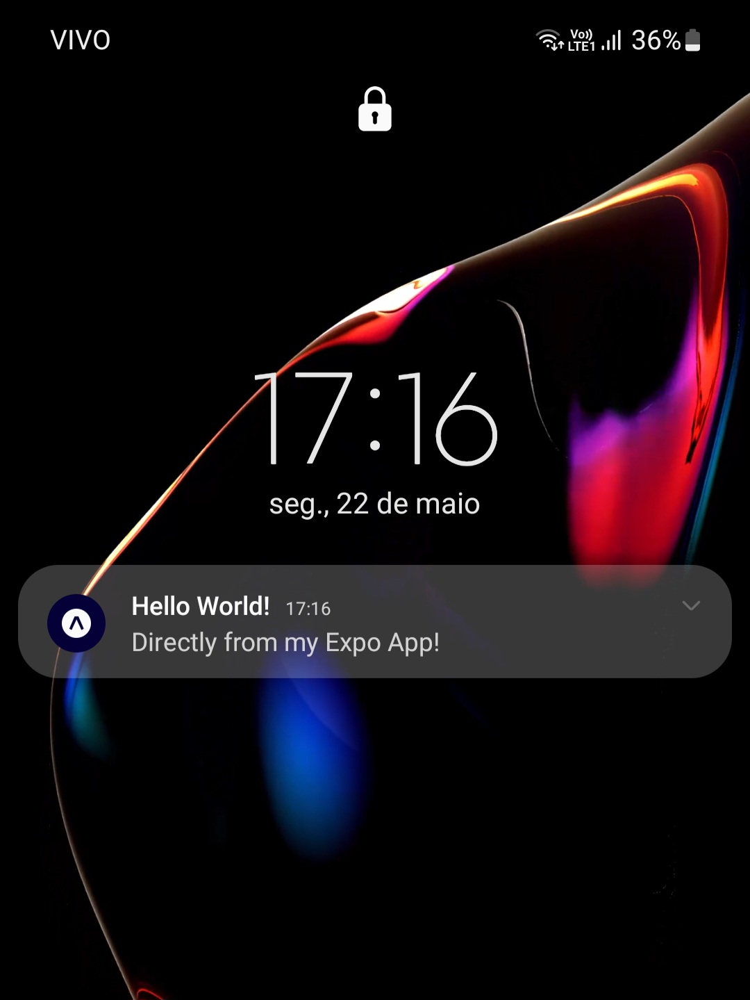

# mobile-push-notifications

## 🚀 Projeto
Um projeto minimalista mostrando o funcionamento de envio de notificações para aplicativos de celular usando a plataforma Expo

<div align="center">
    
</div>

## 🛠️ Tecnologias
- [Expo](https://expo.dev)

## 🗂️ Utilização

### 🐑🐑 Clonando o repositório:

```bash
  $ git clone url-do-projeto.git
```

### ▶️ Rodando o App:

```bash
  $ cd mobile-push-notifications
  $ npm install             #download dependencies to node_modules
  $ npx expo start          #start the project
  #The terminal will compile the code and display a QR code. Open the Expo Go app, and scan this QR code to see the project running on your phone
```

### 📋 TODO:
- Customize notification logo ([see here](https://docs.expo.dev/versions/latest/sdk/notifications/#credentials))
- Make it work outside development mode ([see here](https://docs.expo.dev/push-notifications/faq/#notifications-work-in-development-but-not-after-building-the-app))
